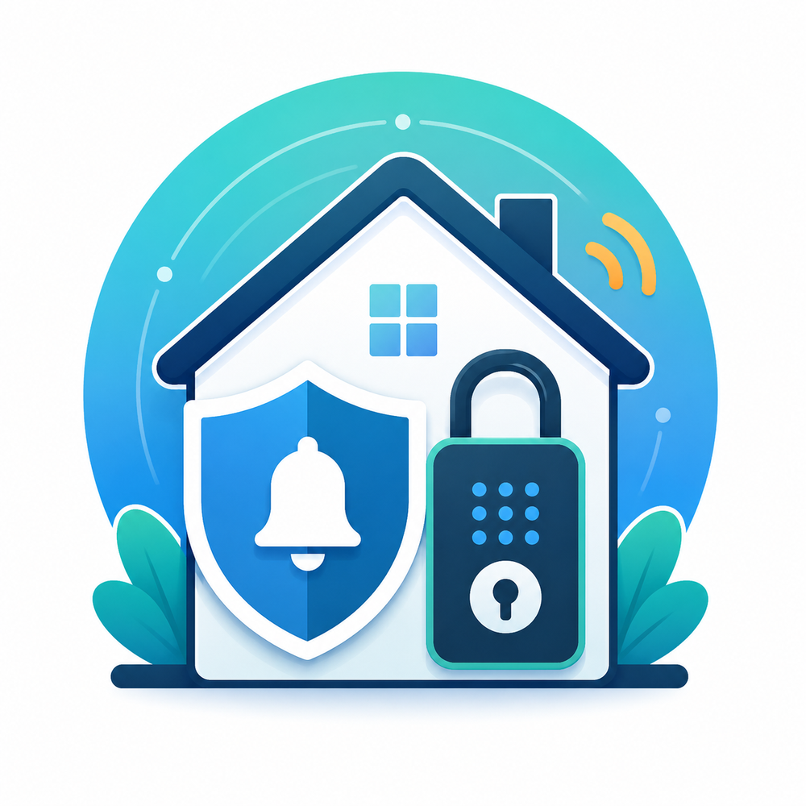

<p align="center">
  
</p>

# Kentix for Home Assistant

A local, HACS-compatible Home Assistant custom integration for KentixONE alarm groups and DoorLocks.

> This project is community-maintained and is not affiliated with or endorsed by Kentix GmbH.

## Features

- Automatic discovery of alarm groups and DoorLocks visible to the SmartAPI user
- Native `alarm_control_panel` entities using the live `alarmgroups[].armed` values from `/api/systemvalues`
- Arm and disarm actions for alarm groups
- One stateless **Release lock** button per DoorLock, matching the Kentix behavior of briefly enabling manual cylinder rotation
- Alarm-group hierarchy in the Home Assistant device registry: site → building → floor → area
- Local KentixONE webhook support for fast state refreshes
- Configurable state polling, with a conservative default of 60 seconds
- Low-load inventory schedule: alarm groups, DoorLocks and DoorLock battery values are refreshed only at startup and then at most every four hours
- UI configuration, reauthentication, diagnostics, and German/English translations

## Installation

### HACS

1. In HACS, open **Custom repositories**.
2. Add this repository and select **Integration** as the category.
3. Download **Kentix**.
4. Restart Home Assistant.
5. Open **Settings → Devices & services → Add integration → Kentix**.

### Manual installation

Copy `custom_components/kentix` to:

```text
<config>/custom_components/kentix
```

Restart Home Assistant and add the integration from **Settings → Devices & services**.

## Configuration

The setup flow asks for:

- KentixONE URL or hostname, for example `https://192.168.1.50`
- Personal SmartAPI bearer token
- Whether Home Assistant should verify the TLS certificate

TLS certificate verification is disabled by default because many local KentixONE appliances use a self-signed certificate. Enable it when Home Assistant trusts the certificate used by KentixONE.

Use a dedicated Kentix user with access only to the required alarm groups and DoorLocks. Door release controls are created automatically when DoorLocks are discovered.

## API request schedule

The integration separates frequent state polling from infrequent discovery to reduce load on KentixONE.

| Schedule | Requests | Purpose |
|---|---|---|
| Every configured polling interval | `GET /api/systemvalues` | Current alarm-group armed state |
| At integration startup | `GET /api/alarmgroups` and `GET /api/doorlocks` | Initial device discovery, hierarchy, and DoorLock battery data |
| At most every 4 hours | `GET /api/alarmgroups` and `GET /api/doorlocks` | Discover newly added objects and refresh DoorLock battery data |
| After a Kentix webhook | `GET /api/systemvalues` | Immediate verification of the current alarm state |
| When a user presses an action | One corresponding `POST` request | Arm, disarm, or release a DoorLock |

The integration does **not** perform periodic per-object detail requests such as `/api/alarmgroups/{id}` or `/api/doorlocks/{id}`.

### Polling interval

The `/api/systemvalues` interval is adjustable under **Settings → Devices & services → Kentix → Configure**.

- Default: **60 seconds**
- Older Kentix hardware: **60 seconds recommended**
- Modern SiteManagers: **30 seconds is usually suitable**
- Shorter intervals increase the load on KentixONE

DoorLock discovery and DoorLock battery data are independent of this option and are refreshed at most once every four hours.

## KentixONE webhook setup

Polling works without a webhook. A webhook allows KentixONE to notify Home Assistant immediately after an event, so the integration can verify the new state without waiting for the next polling cycle.

The webhook payload is only a trigger. Home Assistant does not trust the transmitted state; it reads `/api/systemvalues` after receiving the notification.

### 1. Copy the Home Assistant webhook URL

1. Open **Settings → Devices & services** in Home Assistant.
2. Find **Kentix** and choose **Configure**.
3. Copy the displayed webhook URL.

The URL must be reachable from the KentixONE appliance on the local network. Configure a usable Home Assistant internal URL under **Settings → System → Network** when Home Assistant displays only an unusable hostname or path.

### 2. Create the webhook in KentixONE

In the KentixONE web interface:

1. Open **Automation → Webhooks**.
2. Choose **Create webhook** / **Webhook anlegen**.
3. Configure:
   - **Active:** enabled
   - **Name:** for example `Home Assistant refresh`
   - **URL:** the URL copied from Home Assistant
   - **HTTP method:** `POST`
   - **Authentication:** none
   - **Content type:** `application/json`
   - **Payload:**

```json
{
  "eventType": "kentix_state_changed"
}
```

4. Save the webhook.
5. Use KentixONE's **Test webhook** function. A successful request should return an HTTP status in the `2xx` range.

The random webhook ID in the URL acts as the secret. Do not publish or expose the URL outside the trusted local network.

### 3. Assign the webhook to alarm-group events

A system-wide webhook does nothing until it is assigned to events.

1. Open the relevant alarm group in KentixONE.
2. Open its **Webhooks** section.
3. Assign the Home Assistant webhook to **Change of switching status (arming or disarming)** / **Änderung des Schaltstatus (Scharf- oder Unscharfschaltung)**.
4. Repeat this for every alarm group that should notify Home Assistant.

Depending on the desired automations, the same webhook can additionally be assigned to events such as **All alarms**, **System messages**, **After arming**, or **After disarming**. A cyclical Kentix webhook is not required because Home Assistant polling remains active as a fallback.

KentixONE documentation:

- [Configure webhooks](https://docs.kentix.com/kentixone/guides/how-to/first-steps/webhooks-anlegen/)
- [Webhook reference](https://docs.kentix.com/kentixone/en/forms/webhooks/)
- [Alarm-group webhook events](https://docs.kentix.com/kentixone/en/forms/alarmgroup/AlarmgruppeMaske/)

## Entities and devices

| Kentix data/action | Home Assistant representation |
|---|---|
| Alarm group | `alarm_control_panel` |
| DoorLock manual-rotation release | stateless `button` named **Release lock** / **Schloss freigeben** |
| DoorLock battery | diagnostic `sensor`, when supplied by KentixONE |
| Webhook statistics | disabled-by-default diagnostic sensors |

Alarm groups are named according to their hierarchy:

- `Standort - <Name>` for top-level groups
- `Gebäude - <Name>` for their children
- `Etage - <Name>` for the next level
- `Bereich - <Name>` for deeper levels

Child devices are linked to their parent in the Home Assistant device registry. Newly added alarm groups and DoorLocks are discovered during the next four-hour inventory refresh or after reloading the integration.

## DoorLock behavior

Kentix does not normally report a persistent locked/unlocked state for this use case. The integration therefore exposes one stateless button instead of a Home Assistant lock entity.

Pressing **Release lock** briefly enables the user to rotate the cylinder manually. It does not claim that the door is locked or unlocked. Restrict the SmartAPI user's DoorLock permissions and add suitable confirmation, presence, and authorization conditions to automations controlling physical access.

Example automation action:

```yaml
sequence:
  - action: button.press
    target:
      entity_id: button.front_door_release_lock
```

## Home Assistant events

The integration emits:

- `kentix_alarm_changed`
- `kentix_webhook_received`
- `kentix_door_changed` and `kentix_door_opened` only when a future/compatible Kentix runtime response actually provides door-state data

Example:

```yaml
alias: Notify on Kentix alarm change
triggers:
  - trigger: event
    event_type: kentix_alarm_changed
conditions:
  - condition: template
    value_template: "{{ trigger.event.data.new_state == 'armed' }}"
actions:
  - action: notify.notify
    data:
      title: Kentix alarm group
      message: >-
        {{ trigger.event.data.object_name }} changed from
        {{ trigger.event.data.previous_state }} to
        {{ trigger.event.data.new_state }}.
```

## Security and privacy

- Keep Home Assistant and KentixONE on trusted networks.
- Enable TLS verification when the KentixONE certificate is trusted.
- Never expose the Home Assistant webhook URL publicly.
- Use a least-privilege Kentix API user.
- Tokens, hosts, object names, IDs, and raw Kentix payloads are excluded or redacted from diagnostics.
- Webhook payloads are not persisted and are not treated as authoritative state.

Report security issues privately as described in [SECURITY.md](SECURITY.md).

## Compatibility

The integration uses `/api/systemvalues` for live alarm-group state and the alarm-group/DoorLock collection routes for infrequent inventory discovery. Unsupported or absent runtime values are reported as unknown instead of being guessed.

## License

MIT
